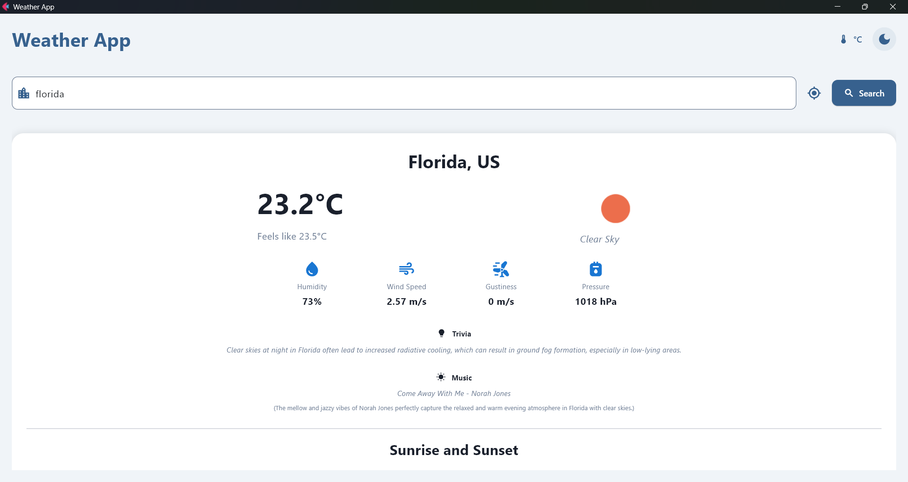
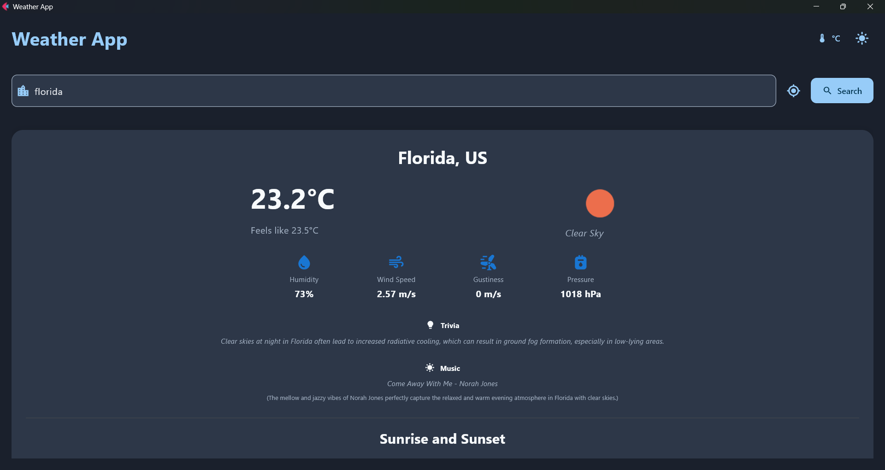
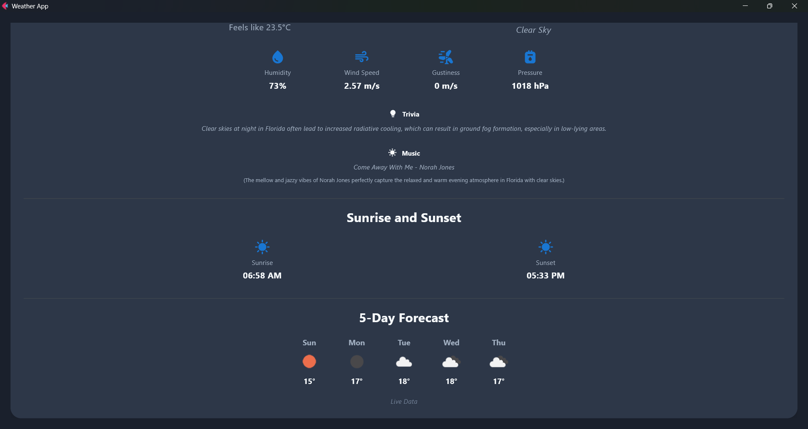
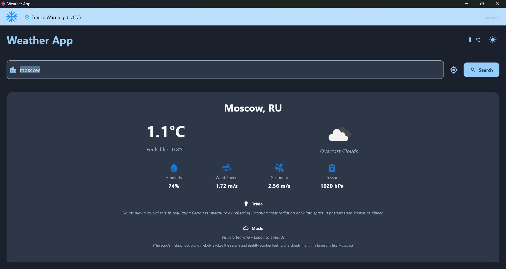
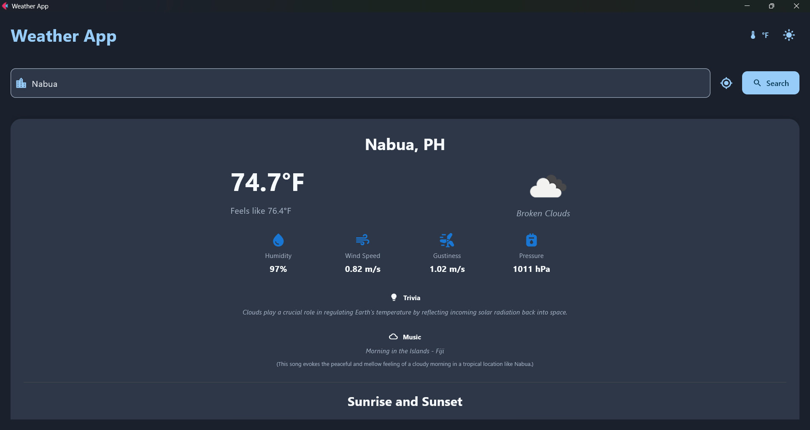

# Weather Application Enhancement

A robust, cross-platform weather dashboard built with **Python** and **Flet (v0.28.3)**. This application integrates the **OpenWeatherMap API** to provide real-time weather data, forecasts, and AI-powered lifestyle recommendations with a responsive, modern UI.

---

## Features

### **Base Features**
- **City Search:** Real-time weather data fetching for any city globally.  
- **Current Weather:** Displays temperature, humidity, wind speed, pressure, and weather conditions.  
- **Material Design UI:** Clean, professional interface with dark/light mode support.  
- **Async Operations:** Non-blocking network calls for a smooth user experience.

### **Enhanced Features (Implemented)**
- **5-Day Forecast:** Scrollable horizontal view of weather conditions for the next 5 days.  
- **Search History:** Saves the last 5 searched cities for quick access.  
- **Temperature Unit Toggle:** Switch instantly between Celsius (°C) and Fahrenheit (°F).  
- **Current Location Weather:** Auto-detects user's city via IP geolocation on startup or via a dedicated button.  
- **Weather Alerts & Warnings:** Smart banners for extreme conditions (heatwaves, freezing, high winds, rain) based on live thresholds.  
- **Offline Mode & Caching:** Caches API responses for 10 minutes; displays “Offline” with timestamp when internet is unavailable.  
- **AI Lifestyle Recommendations:** Uses **Google Gemini AI** to generate unique weather trivia and music suggestions based on weather and time of day.

---

## Technologies Used
- **Flet (v0.28.3):** UI framework  
- **httpx:** Async HTTP client  
- **python-dotenv:** Environment variable management  
- **OpenWeatherMap API:** Weather data  
- **Google Gemini API:** Generative AI content  

---

## Project Structure

```

mod6_labs/
├── main.py              # Main application logic and UI builder
├── weather_service.py   # Service layer for OpenWeatherMap API calls
├── ai_service.py        # Service layer for Google Gemini AI interaction
├── config.py            # Configuration and environment variable management
├── .env                 # API Keys (NOT committed)
├── .env.example         # Environment variable template
└── README.md            # Documentation

````

---

## Setup & Installation

### **1. Clone the repository**
```sh
git clone https://github.com/<your-username>/cccs106-projects.git
cd cccs106-projects/mod6_labs
````

### **2. Create and activate a virtual environment**

**Windows**

```sh
python -m venv venv
venv\Scripts\activate
```

**macOS/Linux**

```sh
python3 -m venv venv
source venv/bin/activate
```

### **3. Install dependencies**

```sh
pip install -r requirements.txt
```

### **4. Configure Environment Variables**

Create a file named `.env` in the root directory.

Copy content from `.env.example` and replace with your actual keys:

```env
OPENWEATHER_API_KEY=your_openweather_api_key_here
GEMINI_API_KEY=your_gemini_api_key_here
```

### **5. Run the Application**

```sh
python main.py
```

---

## Screenshots


### Light Mode


### Dark Mode


### Weather Infos, Solar Events, 5-Day Forecast, and AI Recommendations


### Weather Alerts


### Temperature Toggle


---

## How It Works

* **Initialization:** `main.py` initializes the UI and fetches the user’s location via `httpx`.
* **Data Fetching:** `weather_service.py` calls the OpenWeatherMap API for weather data.
* **Caching:** Results stored in `self.weather_cache`; reused within 10 minutes to reduce API usage.
* **AI Enrichment:** `ai_service.py` sends context (e.g., “Rainy, 25°C, Night”) to Gemini to get trivia and music suggestions.
* **Display:** UI updates dynamically; on network issues, cached data is shown when available.

---