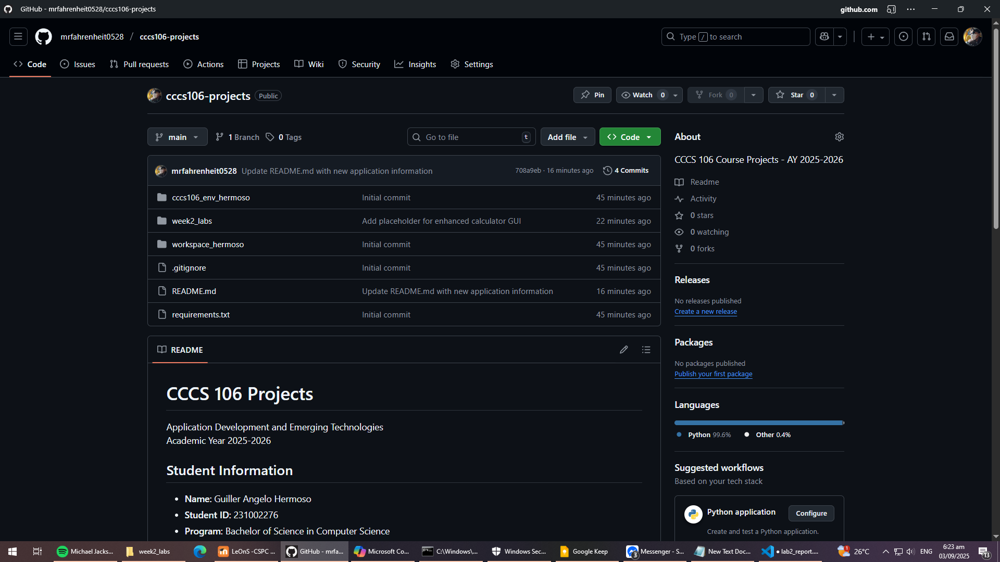
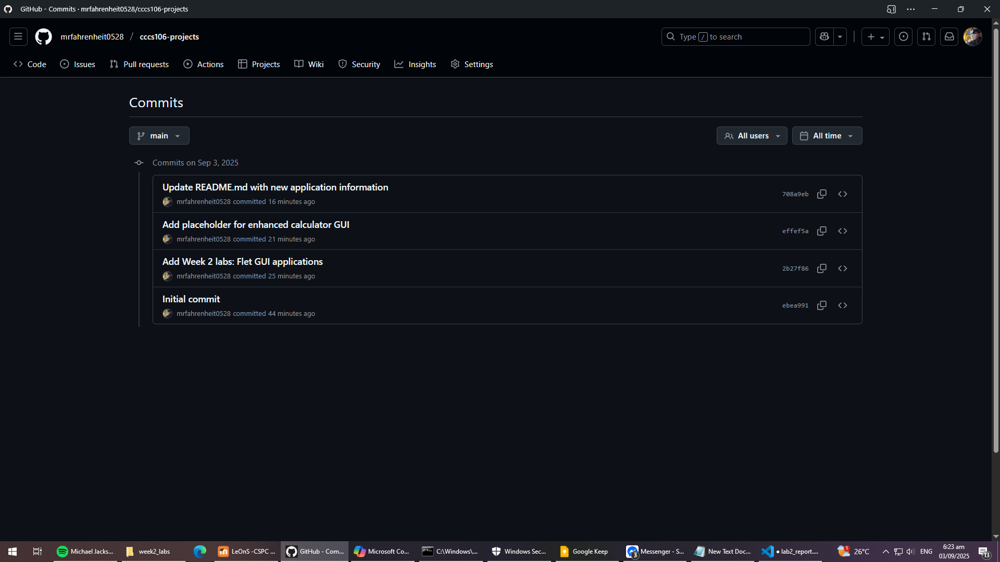
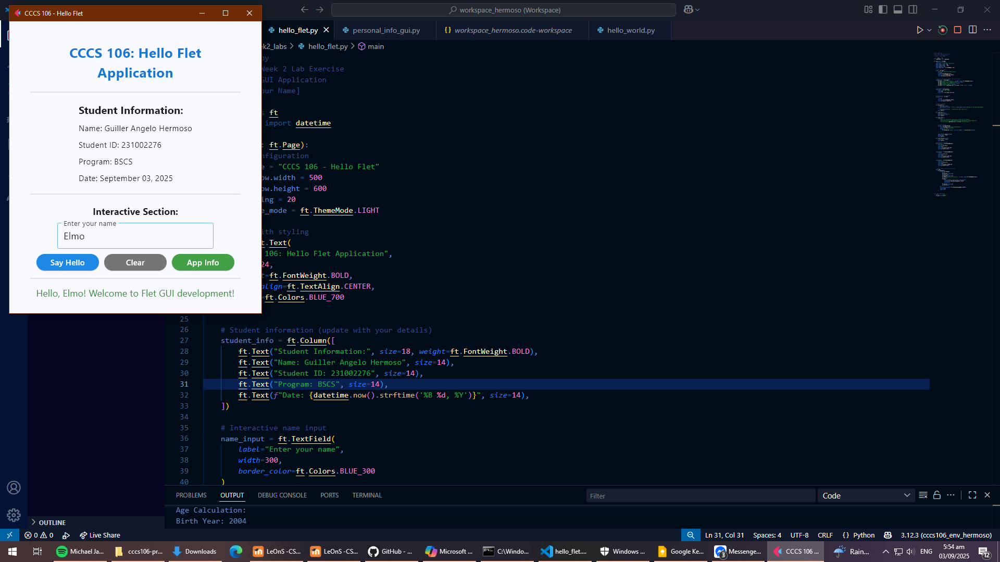
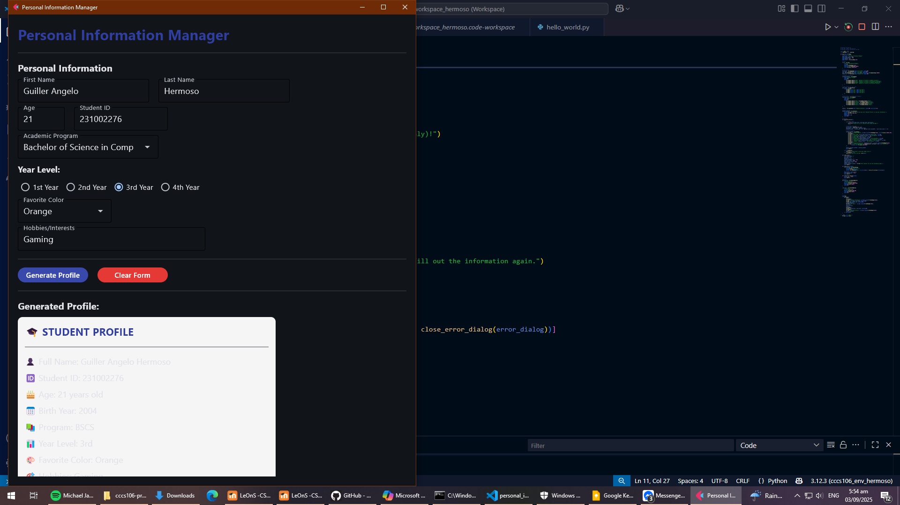

# Lab 2 Report: Git Version Control and Flet GUI Development

**Student Name:** Guiller Angelo Hermoso
**Student ID:** 231002276
**Section:** BSCS 3A
**Date:** September 03, 2025

## Git Configuration

### Repository Setup
- **GitHub Repository:** https://github.com/mrfahrenheit0528/cccs106-projects
- **Local Repository:** ✅ Initialized and connected
- **Commit History:** 4 commits with descriptive messages

### Git Skills Demonstrated
- ✅ Repository initialization and configuration
- ✅ Adding, committing, and pushing changes
- ✅ Branch creation and merging
- ✅ Remote repository management

## Flet GUI Applications

### 1. hello_flet.py
- **Status:** ✅ Completed
- **Features:** Interactive greeting, student info display, dialog boxes
- **UI Components:** Text, TextField, Buttons, Dialog, Containers
- **Notes:** The app info button was not working at first, but its fixed now.

### 2. personal_info_gui.py
- **Status:** ✅ Completed
- **Features:** Form inputs, dropdowns, radio buttons, profile generation
- **UI Components:** TextField, Dropdown, RadioGroup, Containers, Scrolling
- **Error Handling:** Input validation and user feedback
- **Notes:** None

## Technical Skills Developed

### Git Version Control
- Understanding of repository concepts
- Basic Git workflow (add, commit, push)
- Branch management and merging
- Remote repository collaboration

### Flet GUI Development
- Flet 0.28.3 syntax and components
- Page configuration and layout management
- Event handling and user interaction
- Modern UI design principles

## Challenges and Solutions

During Git setup, pushing to the remote failed due to a missing initial commit—solved by committing before pushing. In hello_flet.py, the app info button didn’t respond at first; adding the correct event handler fixed it. For personal_info_gui.py, syncing inputs and validating edge cases required refining logic and improving user feedback.

## Learning Outcomes

I learned how to manage repositories, handle commits, and collaborate using Git. Flet development taught me to build responsive UIs, handle events, and validate user input effectively. These skills strengthened my confidence in version control and GUI programming.

## Screenshots

### Git Repository

### GUI Applications

## Future Enhancements

For hello_flet.py, adding time-based greetings and simple animations could improve user engagement. In personal_info_gui.py, saving profiles locally and enabling image uploads would enhance functionality. Both apps could benefit from better mobile responsiveness and cleaner UI design.